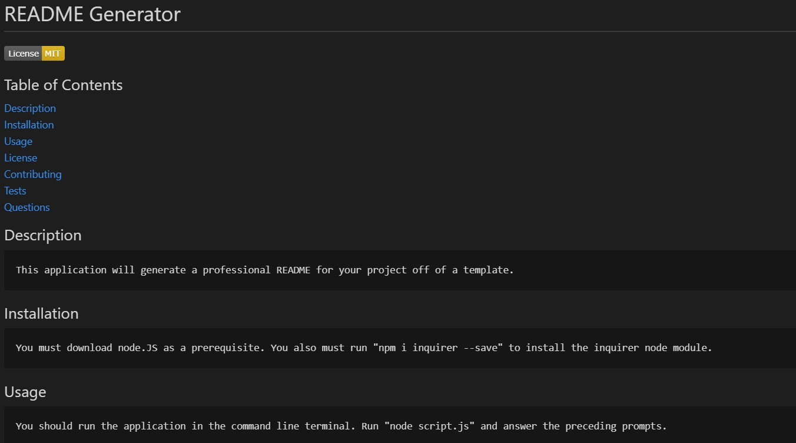

# README Generator     

## Table of Contents
[Description](#Description) 
[Installation](#Installation) 
[Usage](#Usage) 
[License](#License) 
[Contributing](#Contributing) 
[Tests](#Tests) 
[Questions](#Questions)

## Description 
    This application will generate a professional README for your project off of a template. This is useful if you want to have a quick and standard readme format across your applications or just want to save a bit of time on the administrative part of your projects.
  

## Installation 
You must download node.JS as a prerequisite. 
    "npm i inquirer --save" or "npm install" in terminal for the project folder

## Usage 
You should run the application in the command line terminal while in the correct folder. Run "node script.js" and then answer the preceding prompts.

## Tests 
Run through the prompt lines with differing answers for the prompts as well as selecting both MIT and ISC license choices at the list prompt. The license badge and license text should be different based off of which prompt answer you select.

## Technologies Used
Javascript, Node, Inquirer, Terminal

## Questions 
You can reach me via https://github.com/rikioh or at rikiocamp@gmail.com if you have additional questions.